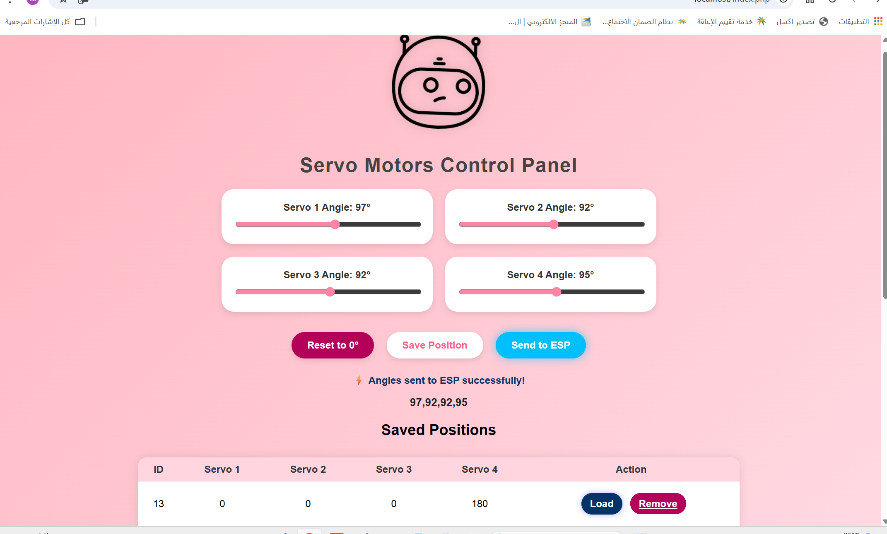
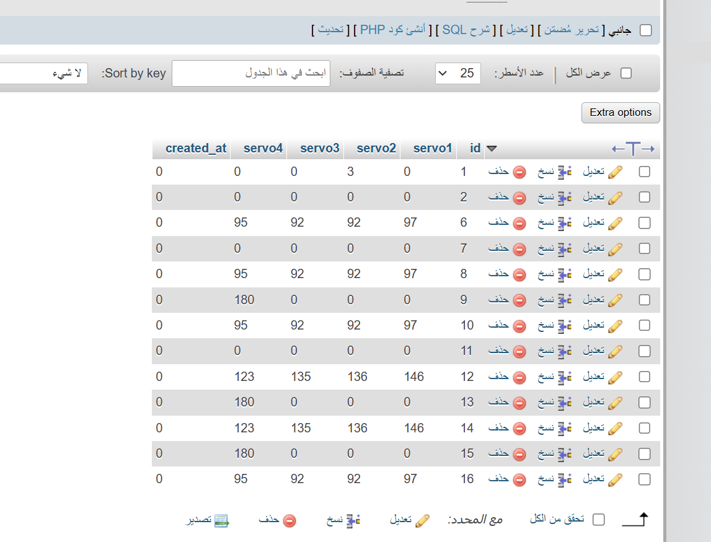

# Servo Motors Control Panel (PHP + MySQL)

A simple web-based control panel for servo motors.  
It allows you to set angles, save positions, load them, and manage all data through a MySQL database.

## 🔧 Features
- 4 servo sliders (0°–180°)
- Save, load, and delete positions
- Data stored in MySQL
- Simple and clean web interface

## 🖼️ Screenshots

### 🔹 Web Interface

### 🔹 Angles.php

### 🔹 Database Structure

